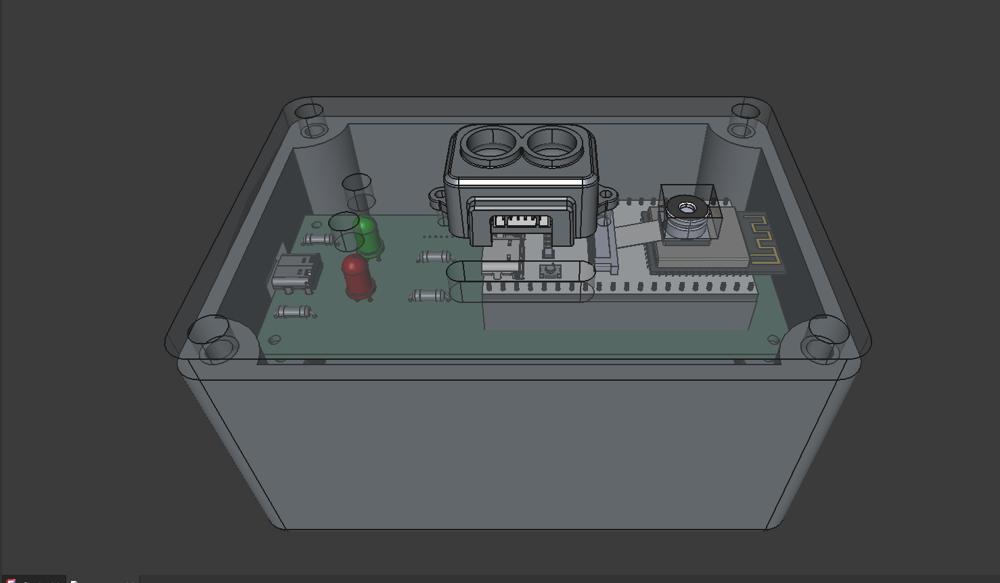
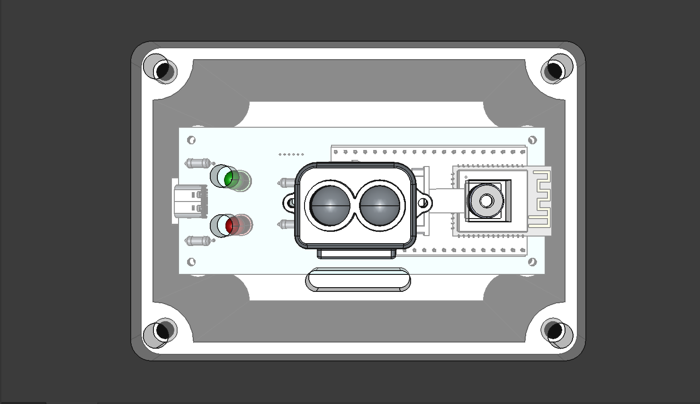
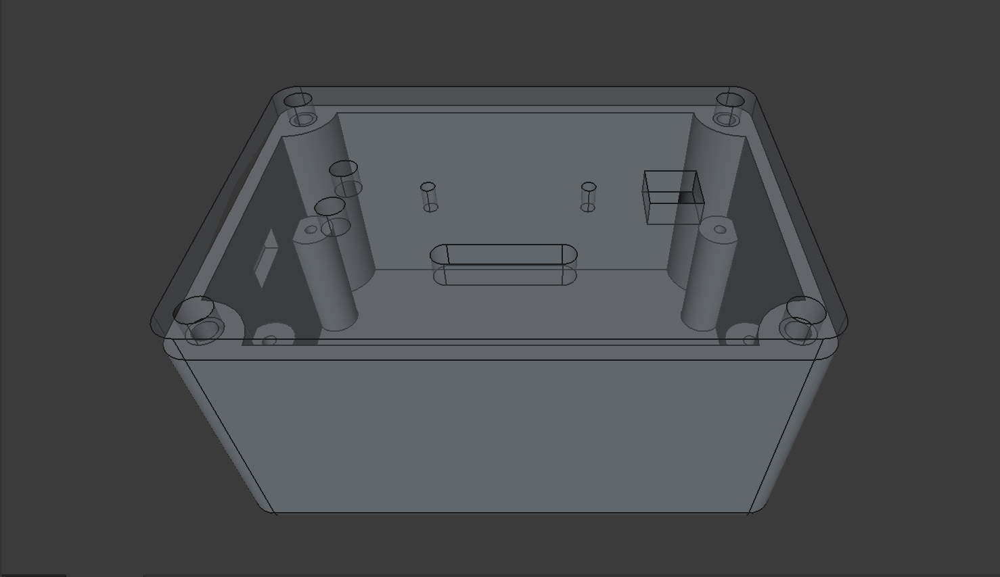
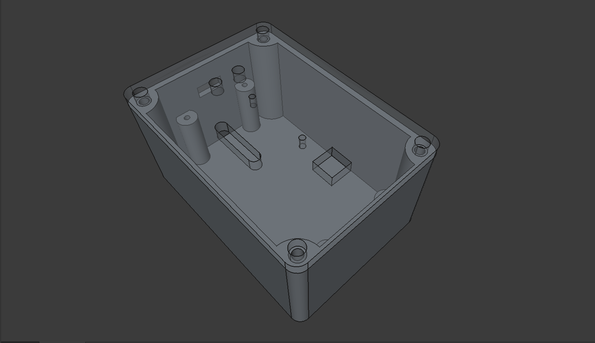
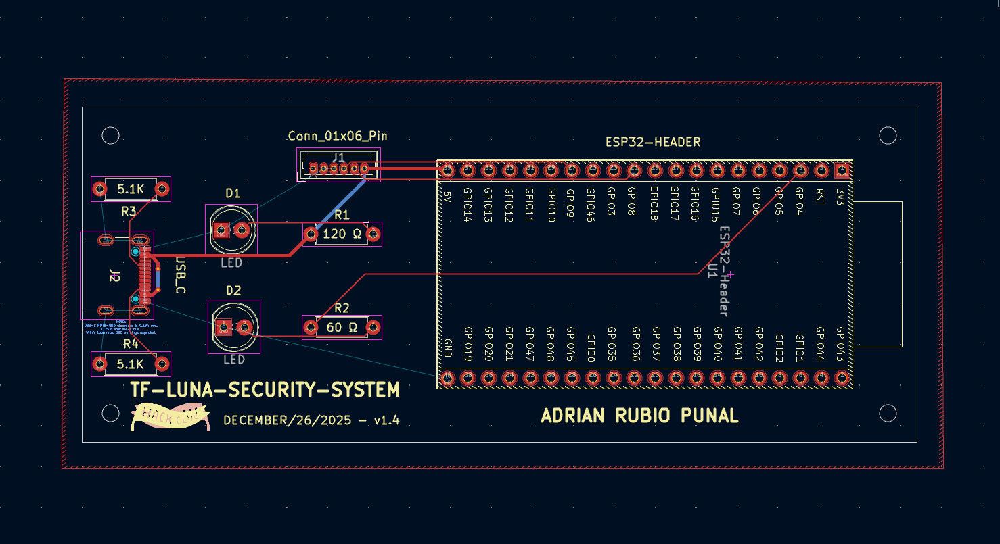
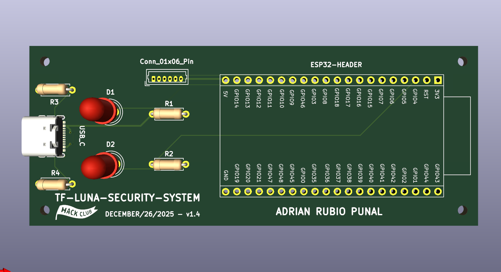
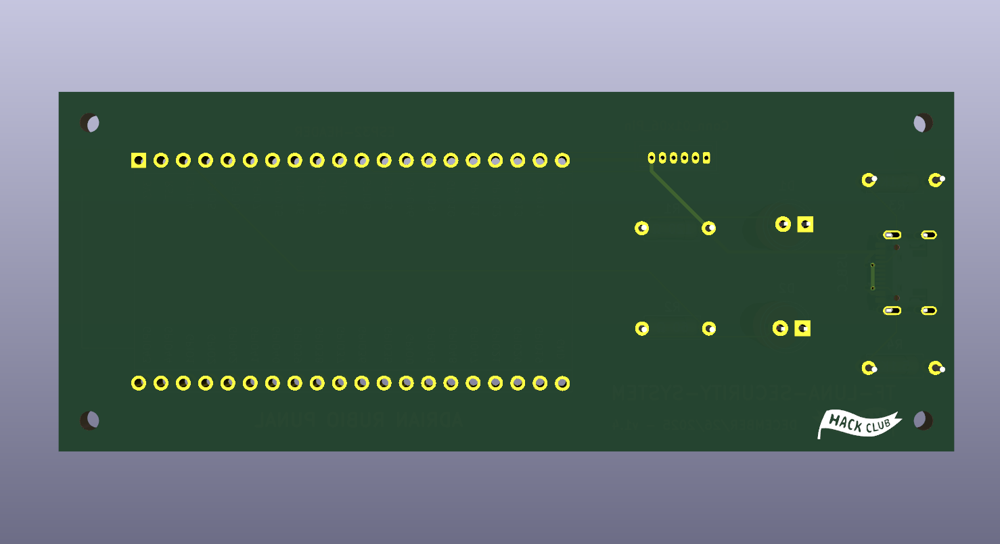

# TF-Luna Security System
**Full Design Process**: [Blueprint Project](https://blueprint.hackclub.com/projects/7234)

An evolution of my Arduino-based security system that uses a TF-Luna LiDAR sensor to detect when someone passes through a bedroom door, triggering the ESP32-CAM to capture a photo of the intruder.

The system is built around a Freenove ESP32-S3-WROOM-1, which communicates with the TF-Luna over I2C to establish a baseline distance and detect motion. When an intruder is detected, the onboard camera captures an image and sends it to Home Assistant via Wi-Fi. A green LED indicates power status while a red LED flashes to signal an intruder alert. The entire system runs off a power bank and is housed in a custom 3D-printed case mounted with a custom carrier PCB, making it a compact, self-contained DIY security setup with future plans for AI-based person identification.

## Features

- **Intruder Detection:** Real-time motion detection using a TF-Luna LiDAR sensor with a focused 2-degree beam
- **Automatic Photo Capture:** ESP32-CAM captures an image when an intruder is detected passing through the door
- **Home Assistant Integration:** Sends captured images and alerts directly to Home Assistant over Wi-Fi
- **LED Indicators:** Green LED for power status, red LED flashes on intruder detection
- **I2C Communication:** Reliable sensor communication at 100Hz with the TF-Luna
- **Custom PCB:** Single carrier board designed in KiCad and manufactured by JLCPCB
- **Custom 3D Printed Case:** Designed in FreeCAD with mounting pillars and cutouts for all components
- **Power Bank Powered:** Runs off a standard power bank for easy and flexible placement
- **Autonomous Operation:** Runs continuously without manual interaction
- **Future AI Integration:** Planned AI-based identification to recognize the homeowner

## Hardware/BOM

| Component | Qty | Type |
|-----------|-----|------|
| Freenove ESP32-S3-WROOM-1 | 1 | Controller |
| TF-Luna LiDAR Sensor | 1 | LiDAR Sensor |
| microSD Card (32GB) | 1 | Storage |
| Custom Carrier PCB | 1 | PCB |
| Custom 3D Printed Case | 1 | Enclosure |
| Power Bank | 1 | Power |
| USB-A to USB-C Cable | 1 | Cable |
| Mounting Hardware (Assorted Screws) | 1 | Hardware |

## CAD Screenshots

| CAD Assembly (Front View)| CAD Assembly (Top View) |
|--------------------------|-------------------------|
|  |  |

| 3D Case (Front View) | 3D Case (Side View) |
|----------------------|---------------------|
|  |  |

## PCB Screenshots

| PCB Layout |
|-------------------------------|
|  |

| PCB 3D View (Front) | PCB 3D View (Back) |
|----------------------|---------------------|
|  |  |

## Usage
Mount the system above your bedroom door using the 3D-printed case. The TF-Luna LiDAR sensor establishes a baseline distance to the floor and continuously monitors for changes. When someone passes through the doorway, the sensor detects the distance change and triggers the ESP32-CAM to capture a photo. The image is then sent to Home Assistant over Wi-Fi, and the red LED flashes to indicate an intruder was detected. The green LED stays on to confirm the system is powered and running.

## TF-Luna Security System In Action

| Complete Assembly (Side View)|
|------------------------------|
|  |

| Complete Assembly (PCB and Case View) | Complete Assembly (Back View) |
|---------------------------------------|-------------------------------|
|  |  |

**Demo Coming Soon**

## License

MIT License

---

> GitHub [@adrirubio](https://github.com/adrirubio) &nbsp;&middot;&nbsp;
